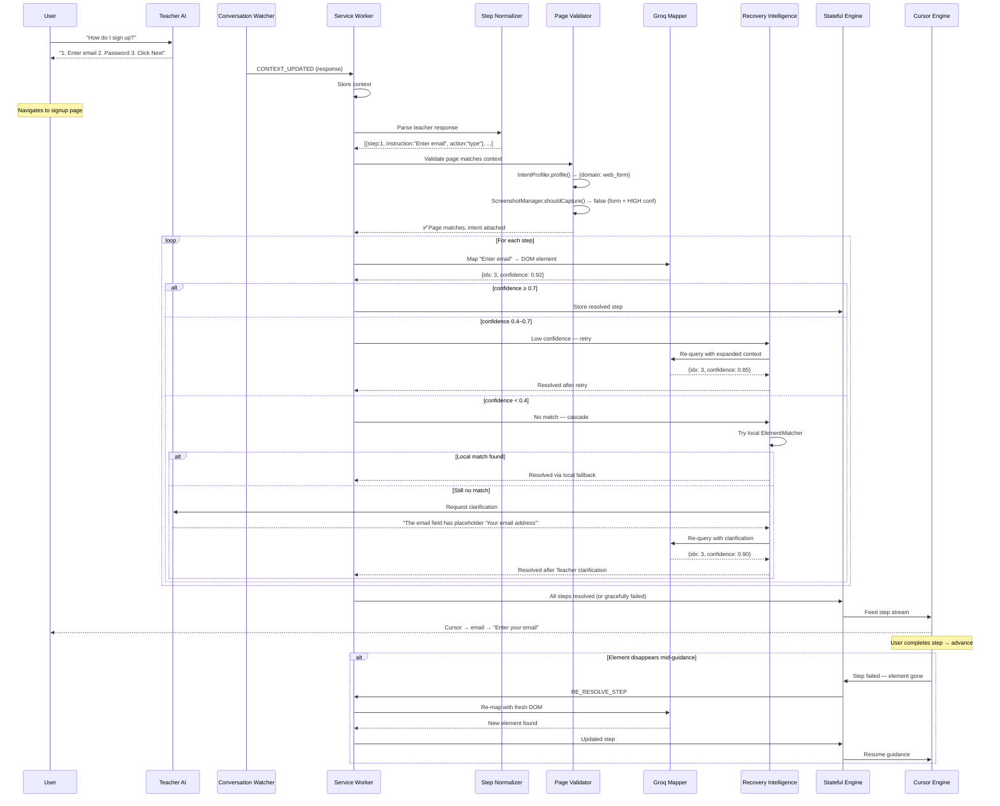

# FolloMe — Explicit Execution-Ready System Plan (v2.resolved)

## 1. SYSTEM OVERVIEW

The FolloMe architecture is a dual-layer real-time browser assistant that converts unstructured, natural-language AI conversational directives into robust, visually-guided interactive state flows. The system runs via purely deterministic pipelines handling parsing, disambiguation, fallback, and synchronization without any blocking UI freeze. Ambiguity is resolved asynchronously via Teacher AI without switching tabs.

## 2. SYSTEM LAYERS

1. **UI Layer**: Manages the overlay, confidence status indicators, and tracking/visualizer modes (such as Speech/Microphone listening mode).
2. **Content Layer**: Houses the `CursorEngine` (60fps animation), `DOMStabilityMonitor`, and `PassiveProgressTracker` (event capture phase listeners). Operates exclusively on pre-resolved elements.
3. **Brain Layer**: Handles `StepNormalizer` (ContextCompressor, Action Extraction), splitting teacher text into explicit step/explanation channels, and computing position metadata based on natural language constraints.
4. **Mapping Layer (Groq)**: The thin reasoning bridge executing batch DOM mapping. Converts an enriched DOM snapshot plus position clues into confidence-scored DOM index references. Uses DOM_ONLY fallback primarily. Vision escalates manually.
5. **Recovery Layer**: A 3-tier cascade (`RecoveryEngine`) designed to gracefully fail-upwards. Tier 1 (Context expansion), Tier 2 (Local `ElementMatcher`), Tier 3 (`DisambiguationProtocol` querying Teacher AI).
6. **State Layer**: The single source of truth (`GuidanceSession`), bound to synchronous mutation logic tracking a `domVersion`. Pushes projection deltas (read-only) down to the runtime content scripts.
7. **Messaging Layer**: Runs strictly via Background-to-Tab channels (`chrome.tabs.sendMessage`). Guarantees zero tab-switching by injecting prompts to the background-paused Teacher AI tab directly.

## 3. FULL EXECUTION PIPELINE (STRICT)

**Execution Constraints**:
* Pipeline MUST abort if `domVersion` increments mid-flight.
* Cursor MUST NEVER block while mapping or reasoning.
* DOM parsing MUST complete before mapped steps push to state.
* Local fallbacks MUST execute prior to Vision or Teacher AI clarifications.

**Execution Flow**:
USER_PROMPT → WATCHER_DETECTS_REPLY → EXTRACT_CONTEXT → NORMALIZE_TEXT_AND_COMPRESS → VALIDATE_PAGE_DOMAIN_AND_INTENT → ACQUIRE_OP_LOCK → DOM_SNAPSHOT_CAPTURE (Version N) → BATCH_GROQ_MAPPING → EVALUATE_SCORES → [IF < 0.4] TRIGGER_RECOVERY_TIERS → [IF SUCCESS] MUTATE_SESSION_STATE_SUCCESS → [ELSE] MUTATE_SESSION_STATE_FAILED → PUSH_PROJECTION_TO_CONTENT_SCRIPT → UPDATE_STEP_QUEUE → ADVANCE_CURSOR_TRANSITION → DETECT_PROGRESS_PASSIVE_EVENT → AUTO_ADVANCE_STEP_QUEUE → REPORT_STEP_COMPLETION → REPEAT_OR_END.

## 4. DATA FLOW (STEP FORMAT)

**Normalizer Flow**:
Raw Teacher Thread → Context Compressor Node → Step Action String + Explanation → Position Clue Matcher → Array of JSON Step Actions.

**Matching/Vision Flow**:
DOM Elements State → Region Assignment Engine → Flat JSON Representation → Batch Prompt Builder → Groq Model Inference `llama-3.1-8b-instant` → JSON Mapping Result → Confidence Sorting.

**Recovery Flow (Tier 3)**:
Unresolved Step JSON → Candidate Element Array → Disambiguation Payload Gen → Messaging Layer Background Relay → Teacher AI Context Ingestion → Clarification Reply Extraction → Regex Option Parser → Updated Step ID.

## 5. DEPENDENCY GRAPH (TEXT)

Teacher AI (Upstream Source)
  ↓ (Background Message)
Conversation Watcher
  ↓ (Webhook/Port Update)
Service Worker Main Thread
  ↓
Step Normalizer → (Intent Profiler / Screenshot Manager) → Groq Mapper
  ↓ (Fallback Request)                  ↓
Recovery Engine ──────────────→ GuidanceState (Session DB)
                                        ↓ (Async Storage)
                                  SyncController (Mutex/Version Control)
                                        ↓ (Message Relay: Projection)
                              CursorEngine (Content Script)
                                        ↑ (Reads)
                                    Step Queue
                                        ↑ (Reads)
             PassiveProgressTracker + DOMStabilityMonitor + CompletionValidator

## 6. COMPONENT BREAKDOWN

All components MUST operate predictably:

* **Conversation Watcher (`watchers/conversation-watcher.js`)**: Passively reads DOM over the AI provider. Non-intrusive.
* **Service Worker (`background/service-worker.js`)**: Orchestrator. Handles `CONTEXT_UPDATED`, `REQUEST_GUIDANCE`, `VOICE_QUERY`.
* **Step Normalizer (`brain/step-normalizer.js`)**: Cleans conversational noise. Uses `ContextCompressor`.
* **Page Validator (`utils/intent-profiler.js`)**: Ensures URL matches the AI task domain. Returns match strategy.
* **Groq Mapper (`brain/groq-mapper.js`)**: Builds Batch-prompt string for Groq.
* **Recovery Engine (`brain/recovery-engine.js`)**: Implements `tier1_silentRetry`, `tier2_statusRetry`, and `tier3_userConfirmation`.
* **State Engine (`brain/guidance-state.js`)**: Owns `GuidanceSession` and `SyncController`. Protects DOM version state.
* **Cursor Guide (`content/cursor-guide.js`)**: Runs 60fps Loop `TransitionEngine`. Modifies `ConfidenceBehavior`.
* **Overlay Layer (`content/overlay.js`)**: Injects Status Badges + recovery state notification + Voice UI.
* **Speech Node (`content/speech.js`)**: Native browser SpeechRecognition to transcribe user voice actions.

## 7. CODE SNIPPETS (UNCHANGED)

All explicit code representations defined by the strict systems logic design are mapped below exactly as sourced from the architecture documents.

```
┌─────────────────────────────────────────────────────────────────┐
│  TEACHER AI  (ChatGPT / Claude / Gemini)                       │
│  ─────────────────────────────────────────────────────────────  │
│  • PRIMARY intelligence — source of truth                       │
│  • ALL reasoning, explanation, step generation                  │
│  • Can be RE-QUERIED when Groq fails (Feedback Loop)           │
│  • User interacts with this naturally                           │
└──────────────────────┬──────────────────────────────────────────┘
                       │ raw teacher response
                       ▼
┌─────────────────────────────────────────────────────────────────┐
│  ❶ STEP NORMALIZATION LAYER  [NEW]                             │
│  ─────────────────────────────────────────────────────────────  │
│  • Cleans, deduplicates, and standardizes Teacher output        │
│  • Extracts only actionable steps (separates explanation)       │
│  • Handles numbered, bulleted, conversational, mixed formats    │
│  • Resolves vague instructions ("continue", "next", "do it")   │
│  • Output: clean StepSequence[] ready for mapping               │
└──────────────────────┬──────────────────────────────────────────┘
                       │ normalized steps
                       ▼
┌─────────────────────────────────────────────────────────────────┐
│  ❷ PAGE VALIDATION LAYER  [NEW]                                │
│  ─────────────────────────────────────────────────────────────  │
│  • Intent Profiler runs HERE (domain, complexity, mode)         │
│  • Verifies current page context matches Teacher's guidance     │
│  • Screenshot Manager captures visual state for complex UIs     │
│  • Prevents executing guidance meant for a different page       │
│  • Attaches page metadata (domain, intent) to each step        │
└──────────────────────┬──────────────────────────────────────────┘
                       │ validated, context-enriched steps
                       ▼
┌─────────────────────────────────────────────────────────────────┐
│  ❸ GROQ MAPPER  (Element Resolution — NO Reasoning)            │
│  ─────────────────────────────────────────────────────────────  │
│  • Maps each instruction → DOM element                          │
│  • Uses intent/domain hints for smarter matching                │
│  • Returns confidence score with each match                     │
│  • On LOW confidence: triggers Recovery Intelligence            │
│  • On NO match: triggers Feedback Loop                          │
└──────────────────────┬──────────────────────────────────────────┘
                       │ resolved elements + confidence
                       ▼
┌─────────────────────────────────────────────────────────────────┐
│  ❹ RECOVERY INTELLIGENCE  [NEW]                                │
│  ─────────────────────────────────────────────────────────────  │
│  • If Groq confidence < threshold:                              │
│    → Retry with expanded DOM context (parent text, siblings)    │
│    → Try local ElementMatcher as fallback (fuzzy scoring)       │
│    → Screenshot-augmented re-query (for visual UIs)             │
│    → Request clarification from Teacher AI (last resort)        │
│  • Max 3 retries per step, then graceful degradation            │
│  • NO silent failures — every failure path is handled           │
└──────────────────────┬──────────────────────────────────────────┘
                       │ resolved or gracefully-failed steps
                       ▼
┌─────────────────────────────────────────────────────────────────┐
│  ❺ STATEFUL GUIDANCE ENGINE  [NEW]                             │
│  ─────────────────────────────────────────────────────────────  │
│  • Maintains full session state: steps, progress, retries       │
│  • Survives page navigation (stores in chrome.storage.session)  │
│  • Handles: step re-ordering, skipping, replaying               │
│  • Tracks: which steps succeeded, which failed, why             │
│  • Feeds Cursor Engine with pre-resolved step stream            │
└──────────────────────┬──────────────────────────────────────────┘
                       │ step-by-step feed
                       ▼
┌─────────────────────────────────────────────────────────────────┐
│  ❻ CURSOR ENGINE  (Visual Guidance — Zero Intelligence)        │
│  ─────────────────────────────────────────────────────────────  │
│  • Animates cursor to resolved elements                         │
│  • Shows overlay labels, highlights, step badges                │
│  • Waits for user interaction before advancing                  │
│  • Reports completion/failure back to Stateful Engine            │
│  • Purely visual — no parsing, no API calls                     │
└─────────────────────────────────────────────────────────────────┘
```



```javascript
// Core capabilities:
const StepNormalizer = {
  /**
   * Parse raw teacher text into clean, actionable steps.
   * Handles: numbered, bulleted, conversational, mixed formats.
   */
  normalize(rawTeacherResponse) → StepSequence[],

  /**
   * Resolve vague instructions using conversation context.
   * "continue" → looks at last step + page state to infer next action
   * "next" → advances to the next logical UI element
   * "do the same" → repeats previous action pattern
   */
  resolveVague(instruction, conversationContext, pageState) → string,

  /**
   * Separate explanation text from actionable steps.
   * Returns: { explanation: string, steps: StepSequence[] }
   */
  splitExplanationAndSteps(rawText) → { explanation, steps },

  /**
   * Detect action type from natural language.
   * "Enter your email" → { action: "type", target: "email" }
   * "Click the blue button" → { action: "click", target: "blue button" }
   * "Select 'Male' from the dropdown" → { action: "select", target: "dropdown", value: "Male" }
   */
  detectAction(instruction) → { action, target, value? }
};
```

```javascript
/**
 * NEW: Validate that the current page matches Teacher AI's guidance context.
 * Compares teacher's mentioned URL/page clues against actual page.
 */
function validatePageMatch(teacherResponse, currentPageMeta) → {
  matches: boolean,
  confidence: number,   // 0.0 - 1.0
  reasons: string[]     // ["URL contains 'instagram'", "Page has signup form"]
}

/**
 * NEW: Generate domain-specific matching hints for Groq.
 * For web_form: prefer label/placeholder matching
 * For design_tool: prefer icon/tooltip matching + screenshot
 * For dashboard: prefer chart labels + section headers
 * For code_editor: prefer tab names + file tree items
 */
function getMatchingStrategy(domain) → MatchingStrategy
```

```javascript
// Decision tree for screenshot capture:
// IF domain is design_tool/dashboard → ALWAYS capture
// IF Groq confidence < 0.5 on ANY step → capture as recovery aid
// IF mode is inspect/learn → capture for explanation context
// ELSE → skip (save bandwidth and tokens)
```

```javascript
async function mapInstructionToElement(instruction, domElements, context) {
  // context includes: { domain, intent, matchingStrategy, screenshot? }
  
  const prompt = buildMapperPrompt(instruction, domElements, context);
  const result = await callGroqAPI(prompt);
  
  return {
    idx: result.idx,
    selector: result.selector,       // CSS selector hint (optional)
    confidence: result.confidence,   // 0.0 - 1.0
    alternates: result.alternates    // [NEW] top-3 alternate matches
  };
}
```

```
# For web_form domain:
"Match using field labels, placeholders, and input names. Prioritize exact label matches."

# For design_tool domain:
"Match using toolbar tooltips, icon aria-labels, and panel headers.
A screenshot is attached — use it to identify visual tools."

# For dashboard domain:
"Match using section headings, chart titles, and table headers.
Elements may be dynamically rendered — look for closest semantic match."

# For code_editor domain:
"Match using tab names, file tree labels, and toolbar text.
Buttons may use icon-only labels — check aria-label and title attributes."
```

```javascript
const RecoveryEngine = {
  /**
   * Three-tier retry cascade for failed element resolution.
   * Tier 1: Re-query Groq with expanded DOM context
   * Tier 2: Fall back to local ElementMatcher (fuzzy scoring)
   * Tier 3: Request clarification from Teacher AI
   */
  async recover(failedStep, domElements, options) → RecoveryResult,

  /**
   * Handle dynamic page changes mid-guidance.
   * Detects: modal appears, page navigates, DOM restructures.
   * Re-scans DOM and re-resolves remaining steps.
   */
  async handlePageChange(currentSteps, newDOMSnapshot) → UpdatedSteps,

  /**
   * Build a clarification request for Teacher AI.
   * "I can't find the element described as 'Submit button'.
   *  Available elements: [Login, Sign Up, Cancel].
   *  Which one did you mean?"
   */
  buildClarificationRequest(failedStep, availableElements) → string,

  /**
   * Handle partial matches — element found but with low confidence.
   * Uses: renamed buttons, layout changes, A/B test variants.
   */
  resolvePartialMatch(step, candidates) → BestMatch | null
};
```

```
Previous query found no match for "Submit button".
Here is expanded context:
- Parent containers: <div class="form-actions">, <footer>
- Nearby text: "By clicking Submit, you agree to..."
- Similar elements: [4] button "Sign Up", [7] button "Register"
Which element most likely matches "Submit button"?
```

```
[FolloMe Notice in Overlay]
"I couldn't find 'Submit button' on this page.
Did you mean 'Sign Up' or 'Register'?
Asking the Teacher AI for clarification..."
```

```javascript
const GuidanceState = {
  // ── Core State ──
  sessionId: string,              // unique per guidance session
  teacherResponse: string,        // original teacher text
  teacherQuery: string,           // what user asked
  steps: GuidanceStep[],          // all steps with state
  currentStepIndex: number,       // which step we're on
  status: 'idle' | 'active' | 'paused' | 'recovering' | 'completed' | 'failed',

  // ── Per-Step State ──
  // Each GuidanceStep tracks:
  // {
  //   instruction: string,
  //   action: string,
  //   element: DOMElement | null,
  //   confidence: number,
  //   status: 'pending' | 'active' | 'completed' | 'failed' | 'skipped',
  //   retryCount: number,          // how many times we've attempted resolution
  //   retryHistory: RetryRecord[], // what we tried and why it failed
  //   resolvedVia: 'groq' | 'local' | 'teacher_clarification' | 'manual'
  // }

  // ── Persistence ──
  save() → chrome.storage.session,   // survives tab close
  restore() → GuidanceState | null,  // resume after navigation

  // ── Navigation Handling ──
  onPageChange(newURL, newDOM) → void,  // re-resolve remaining steps
  onDOMChange(mutations) → void,        // re-resolve if target elements changed
};
```

```javascript
// cursor-guide.js additions:
function reportStepOutcome(stepIndex, outcome) {
  // outcome: 'completed' | 'element_gone' | 'element_hidden' | 'user_skipped'
  chrome.runtime.sendMessage({
    type: 'STEP_OUTCOME',
    stepIndex,
    outcome
  });
}
```

```
Teacher says: "Click the Submit button"
Page has: [Sign Up] [Register] [Cancel]

→ Groq primary match: null (no "Submit" text)
→ Groq alternates: [{idx: 0, text: "Sign Up", confidence: 0.6}]
→ Recovery Tier 1: expand context → parent has class "signup-form" → "Sign Up" matches
→ Confidence raised to 0.75 → accept as match
```

```
Teacher says: "Click Continue"
Page has: [Next Step] [Go Back]

→ Groq primary: null
→ Recovery Tier 2: local ElementMatcher → partial text match "Next Step" (semantic similarity)
→ Score: 45/100 (above 30 threshold) → accept with "low" confidence
→ Cursor shows: "Click here (might be 'Continue')" with amber indicator
```

```
User on step 3/5, page loads new content via AJAX

→ DOM MutationObserver detects structural change
→ Stateful Engine pauses cursor
→ Re-scans DOM → re-resolves steps 3, 4, 5 with new elements
→ If steps still valid → resume
→ If steps broken → show "Page changed — re-analyzing..."
```

```
Teacher says: "Select the rectangle tool from the toolbar"
DOM has: <canvas>, 5 <button> with icon-only (no text)

→ IntentProfiler.getDomain() → "design_tool"
→ ScreenshotManager.capture() → sends screenshot to Groq
→ Groq uses screenshot + aria-labels/tooltips to match
→ Matches button with aria-label="Rectangle" or title="Rectangle (R)"
```

```
Teacher says: "Now continue with the next field"
→ Step Normalizer resolveVague():
  - Last completed step: "Enter email" (was input at idx:3)
  - Next interactive element after idx:3 in DOM order: input at idx:4 (Password)
  - Resolved instruction: "Enter your password"
```

```
┌─────────────────────────────────────────────────────────────────┐
│  SLOW BRAIN LAYER  (Service Worker — async, ~300ms per cycle)  │
│  ─────────────────────────────────────────────────────────────  │
│  • Groq API calls (batch)                                       │
│  • Recovery engine                                              │
│  • State persistence                                            │
│  • Teacher AI communication                                     │
│  • Runs INDEPENDENTLY of cursor                                 │
│  • Pushes resolved steps into StepQueue (shared buffer)         │
└──────────────────────┬──────────────────────────────────────────┘
                       │ StepQueue (async push, sync read)
                       ▼
┌─────────────────────────────────────────────────────────────────┐
│  FAST CURSOR LAYER  (Content Script — 60fps rAF loop)          │
│  ─────────────────────────────────────────────────────────────  │
│  • Reads pre-resolved steps from StepQueue                      │
│  • Lerp animation toward current target                         │
│  • Auto-advances when progress detected                         │
│  • NEVER calls APIs, NEVER awaits async work                    │
│  • Shows whatever is available RIGHT NOW                        │
│  • If next step isn't resolved yet → cursor floats, label shows │
│    "Preparing next step..." (no freeze, no stop)                │
└─────────────────────────────────────────────────────────────────┘
```

```javascript
// In brain/guidance-state.js — the decoupling mechanism

class StepQueue {
  constructor() {
    this._steps = [];           // all steps (resolved or pending)
    this._resolvedUpTo = -1;    // index of last resolved step
    this._activeStep = 0;       // index cursor is currently on
  }

  /**
   * SLOW LAYER writes: Push resolved step data.
   * Called by service worker after Groq batch returns.
   * Non-blocking — cursor doesn't wait for this.
   */
  pushResolved(index, elementData) {
    this._steps[index] = {
      ...this._steps[index],
      ...elementData,
      status: 'resolved',
      resolvedAt: Date.now()
    };
    this._resolvedUpTo = Math.max(this._resolvedUpTo, index);
  }

  /**
   * FAST LAYER reads: Get the current step for cursor targeting.
   * Returns immediately — never blocks.
   * If step isn't resolved yet, returns a "pending" placeholder.
   */
  getCurrentStep() {
    const step = this._steps[this._activeStep];
    if (!step) return null;
    if (step.status !== 'resolved') {
      return { ...step, status: 'pending', element: null };
    }
    return step;
  }

  /**
   * FAST LAYER reads: Peek at the NEXT step for lookahead animation.
   * Cursor starts moving toward step N+1 BEFORE step N completes.
   */
  peekNext() {
    return this._steps[this._activeStep + 1] || null;
  }

  /**
   * How far ahead has the brain resolved?
   * Cursor uses this to know if it can lookahead or must wait.
   */
  getResolvedAhead() {
    return this._resolvedUpTo - this._activeStep;
  }

  advance() {
    this._activeStep++;
  }
}
```

```javascript
// In brain/groq-mapper.js — BATCH mapping (replaces per-step mapInstructionToElement)

async function batchMapInstructions(steps, domElements, context, signal) {
  const prompt = buildBatchPrompt(steps, domElements, context);

  const response = await fetch(GROQ_ENDPOINT, {
    method: 'POST',
    headers: {
      'Authorization': `Bearer ${apiKey}`,
      'Content-Type': 'application/json'
    },
    body: JSON.stringify({
      model: selectModel(context.mode),
      messages: [{ role: 'user', content: prompt }],
      temperature: 0,
      max_tokens: 512
    }),
    signal
  });

  const data = await response.json();
  return parseBatchResponse(data, steps.length);
}

function buildBatchPrompt(steps, domElements, context) {
  let prompt = `You are an element resolver. Given UI elements and a list of instructions, return the matching element for EACH instruction in one response.

PAGE: ${context.pageURL}
ELEMENTS:\n`;

  for (const el of domElements) {
    prompt += `[${el.idx}] ${el.type}, text="${el.text}", region=${el.region}`;
    if (el.ariaLabel) prompt += `, aria="${el.ariaLabel}"`;
    if (el.placeholder) prompt += `, placeholder="${el.placeholder}"`;
    if (el.title) prompt += `, title="${el.title}"`;
    prompt += '\n';
  }

  prompt += `\nINSTRUCTIONS:\n`;
  for (let i = 0; i < steps.length; i++) {
    prompt += `[${i}] "${steps[i].instruction}"`;
    if (steps[i].positionHint) prompt += ` (hint: ${steps[i].positionHint})`;
    prompt += '\n';
  }

  prompt += `\nReturn a JSON array with one entry per instruction:
[{"step":0,"idx":N,"confidence":0.0-1.0}, {"step":1,"idx":N,"confidence":0.0-1.0}, ...]
If no match for a step: {"step":N,"idx":null,"confidence":0}`;

  return prompt;
}

function parseBatchResponse(data, stepCount) {
  try {
    const text = data.choices[0].message.content;
    // Extract JSON array from response
    const jsonMatch = text.match(/\[[\s\S]*\]/);
    if (!jsonMatch) return Array(stepCount).fill({ idx: null, confidence: 0 });

    const results = JSON.parse(jsonMatch[0]);
    // Ensure we have entries for all steps
    const mapped = Array(stepCount).fill(null);
    for (const r of results) {
      if (r.step >= 0 && r.step < stepCount) {
        mapped[r.step] = { idx: r.idx, confidence: r.confidence || 0 };
      }
    }
    return mapped.map(m => m || { idx: null, confidence: 0 });
  } catch (e) {
    console.error('[GroqMapper] Batch parse failed:', e);
    return Array(stepCount).fill({ idx: null, confidence: 0 });
  }
}
```

```
BEFORE (per-step):   5 steps × 300ms = 1500ms before cursor starts
AFTER  (batch):      1 call  × 350ms =  350ms, ALL steps resolved, cursor starts immediately
```

```javascript
// In service-worker.js — the full batch pipeline

async function executeGuidancePipeline(teacherData, domSnapshot, intentProfile) {
  const { steps, explanation } = StepNormalizer.normalize(teacherData.response);
  const queue = new StepQueue();

  // Initialize queue with pending steps (cursor can start showing step 1 instruction immediately)
  for (let i = 0; i < steps.length; i++) {
    queue._steps[i] = { ...steps[i], status: 'pending', index: i };
  }

  // Send queue to content script IMMEDIATELY (cursor starts moving to area of first step)
  sendToContentScript({ type: 'GUIDANCE_START', queue: queue.serialize(), explanation });

  // === BATCH RESOLVE (async — cursor is already moving) ===
  const batchResults = await groqMapper.batchMapInstructions(
    steps, domSnapshot.elements,
    { mode: 'DOM_ONLY', domain: intentProfile.domain, pageURL: domSnapshot.url },
    syncController.signal
  );

  // Push all resolved steps into queue
  for (let i = 0; i < batchResults.length; i++) {
    const result = batchResults[i];
    if (result.confidence >= 0.7) {
      queue.pushResolved(i, {
        elementIdx: result.idx,
        confidence: result.confidence,
        resolvedVia: 'groq_batch'
      });
    } else if (result.confidence >= 0.4) {
      // Medium — try local matcher enhancement
      const localResult = localEnhance(steps[i], domSnapshot.elements, result);
      queue.pushResolved(i, localResult || { ...result, resolvedVia: 'groq_low' });
    } else {
      // Low/no match — queue for recovery (async, doesn't block cursor)
      scheduleRecovery(i, steps[i], domSnapshot);
    }
  }

  // Push resolved data to content script (cursor updates targets smoothly)
  sendToContentScript({ type: 'STEPS_RESOLVED', updates: queue.getResolvedSteps() });
}
```

```javascript
// In cursor-guide.js — confidence drives UX behavior

const ConfidenceBehavior = {

  /**
   * Returns the UX behavior for a step based on its confidence.
   * This runs in the FAST LAYER — no async, no API calls.
   */
  getBehavior(step) {
    const conf = step.confidence;

    if (conf >= 0.85) {
      // HIGH — direct execution: cursor moves, highlight, auto-advance on action
      return {
        tier: 'HIGH',
        highlightColor: '#22c55e',     // green
        showAlternates: false,
        requireConfirmation: false,
        cursorStyle: 'confident',       // solid, no wobble
        transitionSpeed: 1.0            // full speed
      };
    }

    if (conf >= 0.5) {
      // MEDIUM — highlight with options: show the match + top alternate
      return {
        tier: 'MEDIUM',
        highlightColor: '#f59e0b',     // amber
        showAlternates: true,           // show "Did you mean X?" below label
        requireConfirmation: false,     // still auto-advance on action
        cursorStyle: 'uncertain',       // slight pulse effect
        transitionSpeed: 0.85           // slightly slower approach
      };
    }

    // LOW — ask user: show candidates, don't auto-advance
    return {
      tier: 'LOW',
      highlightColor: '#ef4444',       // red
      showAlternates: true,
      requireConfirmation: true,        // wait for user to pick
      cursorStyle: 'searching',         // orbit animation
      transitionSpeed: 0.6              // gentle drift
    };
  },

  /**
   * Apply visual styling to cursor based on behavior tier.
   * Called every frame — no allocations, just class toggles.
   */
  applyCursorStyle(cursorEl, behavior) {
    cursorEl.className = `follo-cursor ${behavior.cursorStyle}`;
  }
};
```

```javascript
// In cursor-guide.js — the fast loop uses confidence, never blocks

function runLoop(timestamp) {
  if (!isActive) return;
  requestAnimationFrame(runLoop);
  if (isPaused) return;

  const step = stepQueue.getCurrentStep();
  if (!step) return;

  // ── PENDING STEP: brain hasn't resolved it yet ──
  if (step.status === 'pending') {
    // DON'T FREEZE. Float cursor gently, show preview.
    animateFloating(timestamp);
    showLabel(`${step.instruction}`, currentX, currentY, 'preparing');
    return;
  }

  // ── RESOLVED STEP: apply confidence behavior ──
  const behavior = ConfidenceBehavior.getBehavior(step);
  ConfidenceBehavior.applyCursorStyle(cursorEl, behavior);

  const el = resolveElement(step);
  if (!el) {
    // Element gone — report, don't crash
    reportStepOutcome(stepQueue._activeStep, 'element_gone');
    stepQueue.advance();
    return;
  }

  // ── MOVE TOWARD TARGET ──
  const rect = el.getBoundingClientRect();
  targetX = rect.left + rect.width / 2;
  targetY = rect.top + rect.height / 2;

  const speed = LERP_SPEED * behavior.transitionSpeed;
  currentX += (targetX - currentX) * speed;
  currentY += (targetY - currentY) * speed;
  setCursorPos(currentX - 10, currentY - 10);

  // ── SHOW APPROPRIATE UI ──
  const dist = Math.hypot(targetX - currentX, targetY - currentY);
  if (dist < NEAR_THRESHOLD) {
    if (!arrived) {
      arrived = true;
      showHighlight(rect, behavior.highlightColor);
      showStepLabel(step, behavior);

      if (behavior.requireConfirmation) {
        showCandidateOptions(step); // LOW confidence — user picks
      } else {
        attachProgressTracker(step, el); // HIGH/MEDIUM — track automatically
      }
    }
  }
}
```

```javascript
// In cursor-guide.js — replaces attachInteractionListener for HIGH/MEDIUM confidence

const PassiveProgressTracker = {
  _observers: new Map(),   // stepIndex → { element, handler, cleanup }
  _watchAll: null,          // global capture listener for all interactions

  /**
   * Start tracking ALL steps simultaneously (not just the current one).
   * Called once when guidance starts, tracks the entire step list.
   */
  startTracking(steps) {
    // Single global capture listener — not per-step listeners
    this._watchAll = (event) => {
      const target = event.target;
      for (let i = stepQueue._activeStep; i < steps.length; i++) {
        const step = steps[i];
        if (step.status !== 'resolved') continue;

        const el = resolveElement(step);
        if (!el) continue;

        // Did the user interact with THIS step's element?
        if (el === target || el.contains(target)) {
          this._handleInteraction(i, step, el, event);
        }
      }
    };

    // Capture phase — catches ALL clicks, inputs, changes before bubbling
    document.addEventListener('click', this._watchAll, true);
    document.addEventListener('input', this._watchAll, true);
    document.addEventListener('change', this._watchAll, true);
    document.addEventListener('focus', this._watchAll, true);
  },

  _handleInteraction(stepIndex, step, el, event) {
    // Don't process already-completed steps
    if (step.status === 'completed') return;

    // Validate completion (uses CompletionValidator from Gap 3)
    const validation = CompletionValidator.validateStepCompletion(step, el);

    if (validation.complete) {
      step.status = 'completed';
      step.completedAt = Date.now();
      reportStepOutcome(stepIndex, 'completed');

      // If user completed a FUTURE step (skipped ahead), mark intermediates
      if (stepIndex > stepQueue._activeStep) {
        // User jumped ahead — auto-advance cursor to catch up
        while (stepQueue._activeStep < stepIndex) {
          stepQueue._steps[stepQueue._activeStep].status = 'skipped_by_user';
          stepQueue.advance();
        }
      }

      // Advance to next uncompleted step
      stepQueue.advance();
      skipToNextUncompleted();

      // DON'T reset arrived/cursor state — let the rAF loop smoothly transition
      arrived = false; // triggers cursor to start moving to next target
    }
  },

  /**
   * Skip over steps the user already completed naturally.
   * E.g., user filled email AND password before cursor reached password.
   */
  skipToNextUncompleted() {
    while (stepQueue._activeStep < stepQueue._steps.length) {
      const step = stepQueue._steps[stepQueue._activeStep];
      if (step.status === 'completed' || step.status === 'skipped_by_user') {
        stepQueue.advance();
        continue;
      }
      break;
    }
  },

  stopTracking() {
    if (this._watchAll) {
      document.removeEventListener('click', this._watchAll, true);
      document.removeEventListener('input', this._watchAll, true);
      document.removeEventListener('change', this._watchAll, true);
      document.removeEventListener('focus', this._watchAll, true);
      this._watchAll = null;
    }
  }
};
```

```
Old behavior (step-by-step blocking):
  Cursor → email field     [waits]
  User types email          → cursor advances
  Cursor → password field  [waits]
  User types password       → cursor advances
  Cursor → submit           [waits]
  Time: cursor always one step behind, feels slow

New behavior (continuous tracking):
  Cursor → email field     (user is already typing)
  User types email         → cursor IMMEDIATELY starts moving to password
  User already clicking password → cursor smoothly catches up
  User types password      → cursor starts moving to submit
  User clicks submit       → cursor arrives simultaneously, shows "✓ Complete"
  Time: cursor and user move together, feels alive
```

```javascript
// In content.js — replaces the previous MutationObserver

const DOMStabilityMonitor = {
  _score: 0,
  _THRESHOLD: 30,             // only re-resolve if score ≥ 30
  _resetTimer: null,
  _trackedElements: new Set(), // elements that active steps reference

  /**
   * Register elements that current guidance steps target.
   * Only changes to THESE elements matter.
   */
  trackElements(elements) {
    this._trackedElements = new Set(elements);
  },

  /**
   * Score a batch of mutations. Most mutations score 0.
   * Only mutations affecting tracked elements or major structure score high.
   */
  scoreMutations(mutations) {
    let score = 0;

    for (const m of mutations) {
      // ── SKIP: zero-score mutations (noise) ──
      if (m.type === 'characterData') continue;                                    // text changes
      if (m.type === 'attributes' && m.attributeName === 'style') continue;        // CSS tweaks
      if (m.type === 'attributes' && m.attributeName === 'class') {
        // Class change on a tracked element = significant
        if (this._trackedElements.has(m.target)) { score += 15; continue; }
        continue; // class change on unrelated element = noise
      }

      // ── MEDIUM: attribute changes on tracked elements ──
      if (m.type === 'attributes') {
        if (['disabled', 'hidden', 'aria-hidden', 'aria-disabled'].includes(m.attributeName)) {
          if (this._trackedElements.has(m.target)) { score += 20; continue; }
          score += 2; continue;
        }
        continue; // other attributes = noise
      }

      // ── HIGH: nodes added/removed ──
      if (m.type === 'childList') {
        // Was a TRACKED element removed?
        for (const node of m.removedNodes) {
          if (node.nodeType !== 1) continue;
          if (this._trackedElements.has(node)) { score += 50; continue; } // direct target removed!
          if (node.querySelector && [...this._trackedElements].some(el => node.contains(el))) {
            score += 50; continue; // container of a tracked element removed
          }
        }

        // Were interactive elements added to the main content area?
        for (const node of m.addedNodes) {
          if (node.nodeType !== 1) continue;
          const interactiveCount = (node.matches?.('input,button,select,a,[role="button"]') ? 1 : 0) +
            (node.querySelectorAll?.('input,button,select,a,[role="button"]')?.length || 0);

          if (interactiveCount > 3) { score += 25; continue; }  // modal/form appeared
          if (interactiveCount > 0) { score += 5; continue; }   // minor addition
          // Non-interactive additions (tooltips, spinners) = 0
        }
      }
    }

    return score;
  },

  /**
   * Main mutation callback. Accumulates score over 500ms window.
   * Only fires re-resolve if accumulated score exceeds threshold.
   */
  onMutation(mutations) {
    const batchScore = this.scoreMutations(mutations);
    this._score += batchScore;

    // Debounce: wait 500ms for mutations to settle, then evaluate
    clearTimeout(this._resetTimer);
    this._resetTimer = setTimeout(() => {
      if (this._score >= this._THRESHOLD) {
        console.log(`[DOM] Significant change detected (score: ${this._score}). Re-resolving.`);
        chrome.runtime.sendMessage({
          type: 'DOM_SIGNIFICANT_CHANGE',
          score: this._score,
          affectsTrackedElements: this._score >= 50
        });
      } else {
        console.log(`[DOM] Minor change ignored (score: ${this._score}).`);
      }
      this._score = 0; // reset for next window
    }, 500);
  }
};

// Attach observer
const observer = new MutationObserver((muts) => DOMStabilityMonitor.onMutation(muts));
observer.observe(document.body, {
  childList: true, subtree: true, attributes: true,
  attributeFilter: ['class', 'style', 'disabled', 'hidden', 'aria-hidden', 'aria-disabled']
});
```

```
Tooltip appears        → addedNode, 0 interactive → score: 0    ✗ no re-resolve
Loading spinner        → addedNode, 0 interactive → score: 0    ✗ no re-resolve
CSS hover effect       → attribute 'class' change → score: 0    ✗ no re-resolve
Tracked button hidden  → attribute 'hidden' added → score: 20   ✗ under threshold
Modal with form opens  → addedNode, 5 interactive → score: 25   ✗ under threshold
Target element removed → removedNode tracked      → score: 50   ✓ RE-RESOLVE (only for missing step)
Full page navigation   → many removedNodes         → score: 100+ ✓ RE-RESOLVE (full re-scan)
```

```javascript
// In service-worker.js — graded re-resolution (not full pipeline restart)

case 'DOM_SIGNIFICANT_CHANGE': {
  const { score, affectsTrackedElements } = message;

  if (affectsTrackedElements) {
    // A tracked element was removed/hidden — re-resolve ONLY that step
    const affectedSteps = session.getStepsWithMissingElements();
    for (const step of affectedSteps) {
      const freshDOM = await getContentScriptDOM(sourceTabId);
      const result = await groqMapper.batchMapInstructions(
        [step], freshDOM.elements, context, syncController.signal
      );
      session.updateStep(step.index, result[0]);
    }
    // Push update to cursor (no full restart)
    sendToContentScript({ type: 'STEPS_UPDATED', updates: affectedSteps });
  } else if (score >= 100) {
    // Major structural change — full re-scan but DON'T reset cursor position
    await reRunFullPipeline({ keepCursorPosition: true });
  }
  break;
}
```

```javascript
// In cursor-guide.js — zero-pause transition engine

const TransitionEngine = {
  _currentTarget: null,     // element cursor is at / moving toward
  _nextTarget: null,        // pre-computed next target (lookahead)
  _transitionPhase: 'idle', // idle | approaching | dwelling | transitioning
  _dwellStartTime: 0,
  _DWELL_MIN: 200,         // minimum ms to stay at a target (prevents flickering)

  /**
   * Called every rAF frame. Returns { x, y } for cursor position.
   * Handles smooth transitions without ANY pauses.
   */
  computePosition(timestamp) {
    const currentStep = stepQueue.getCurrentStep();
    const nextStep = stepQueue.peekNext();

    // ── NO STEPS: float gently ──
    if (!currentStep) return this._float(timestamp);

    // ── STEP PENDING (brain hasn't resolved): drift toward expected area ──
    if (currentStep.status === 'pending') {
      return this._driftToArea(currentStep);
    }

    // ── RESOLVE TARGET ELEMENT ──
    const el = resolveElement(currentStep);
    if (!el) {
      // Element gone — smoothly fade and move on
      stepQueue.advance();
      return { x: currentX, y: currentY }; // hold position this frame
    }

    const rect = el.getBoundingClientRect();
    const tx = rect.left + rect.width / 2;
    const ty = rect.top + rect.height / 2;

    // ── APPROACHING: lerp toward target ──
    if (this._transitionPhase === 'idle' || this._transitionPhase === 'transitioning') {
      this._currentTarget = { x: tx, y: ty, rect };
      this._transitionPhase = 'approaching';
    }

    const behavior = ConfidenceBehavior.getBehavior(currentStep);
    const speed = LERP_SPEED * behavior.transitionSpeed;

    currentX += (tx - currentX) * speed;
    currentY += (ty - currentY) * speed;

    const dist = Math.hypot(tx - currentX, ty - currentY);

    // ── ARRIVED: show highlight, start tracking ──
    if (dist < NEAR_THRESHOLD && this._transitionPhase === 'approaching') {
      this._transitionPhase = 'dwelling';
      this._dwellStartTime = timestamp;

      showHighlight(rect, behavior.highlightColor);
      showStepLabel(currentStep, behavior);

      // Pre-compute next target for lookahead
      if (nextStep && nextStep.status === 'resolved') {
        const nextEl = resolveElement(nextStep);
        if (nextEl) {
          const nextRect = nextEl.getBoundingClientRect();
          this._nextTarget = {
            x: nextRect.left + nextRect.width / 2,
            y: nextRect.top + nextRect.height / 2,
            rect: nextRect
          };
        }
      }
    }

    // ── DWELLING: cursor stays, but begins subtle lean toward next target ──
    if (this._transitionPhase === 'dwelling' && this._nextTarget) {
      const dwellTime = timestamp - this._dwellStartTime;
      if (dwellTime > this._DWELL_MIN && currentStep.status === 'completed') {
        // Step was completed during dwell — begin smooth transition
        this._transitionPhase = 'transitioning';
        arrived = false;
        hideHighlight();

        // DON'T snap — let the lerp naturally move toward next target
        stepQueue.advance();
      } else if (dwellTime > 1000) {
        // Even if not completed, start leaning toward next (3% pull)
        currentX += (this._nextTarget.x - currentX) * 0.03;
        currentY += (this._nextTarget.y - currentY) * 0.03;
      }
    }

    return { x: currentX, y: currentY };
  },

  /**
   * Gentle floating animation when no active target.
   * Cursor orbits slowly — feels alive, not frozen.
   */
  _float(timestamp) {
    const amplitude = 20;
    const speed = 0.001;
    currentX += Math.sin(timestamp * speed) * 0.5;
    currentY += Math.cos(timestamp * speed * 1.3) * 0.5;
    return { x: currentX, y: currentY };
  },

  /**
   * Drift toward the expected AREA of a pending step.
   * Uses the instruction text to estimate position even before Groq resolves.
   * E.g., "Enter email" → drift toward the form area (top-center of page).
   */
  _driftToArea(pendingStep) {
    // Use position hint if available
    const hint = pendingStep.positionHint;
    let driftX = window.innerWidth / 2;
    let driftY = window.innerHeight / 3; // default to upper-third

    if (hint) {
      if (hint.includes('top')) driftY = window.innerHeight * 0.2;
      if (hint.includes('bottom')) driftY = window.innerHeight * 0.8;
      if (hint.includes('left')) driftX = window.innerWidth * 0.25;
      if (hint.includes('right')) driftX = window.innerWidth * 0.75;
    }

    // Very slow drift (5% lerp) — not snapping, just gently moving
    currentX += (driftX - currentX) * 0.05;
    currentY += (driftY - currentY) * 0.05;
    return { x: currentX, y: currentY };
  }
};
```

```javascript
// In cursor-guide.js — the core 60fps loop (final architecture)

function runLoop(timestamp) {
  if (!isActive) return;
  requestAnimationFrame(runLoop);
  if (isPaused) return;

  // 1. Compute cursor position (TransitionEngine handles ALL states)
  const pos = TransitionEngine.computePosition(timestamp);
  setCursorPos(pos.x - 10, pos.y - 10);

  // 2. Check if passive tracker detected completion (async events, not polled)
  //    PassiveProgressTracker handles this via event listeners — no polling needed here

  // 3. Update overlay step counter (cheap — just DOM text update)
  const step = stepQueue.getCurrentStep();
  if (step) {
    updateStepCounter(stepQueue._activeStep + 1, stepQueue._steps.length);
  }
}

// That's it. The loop is TINY. All intelligence is in:
// - TransitionEngine (position computation)
// - PassiveProgressTracker (completion detection)
// - ConfidenceBehavior (visual styling)
// None of them do async work. None of them call APIs.
```

```
T+0ms     User navigates to target page
T+10ms    content.js fires PAGE_READY → sends DOM snapshot to service worker
T+15ms    Service worker checks stored Teacher context → match found
T+20ms    StepNormalizer.compress() + normalize() → steps extracted (sync, ~5ms)
T+25ms    StepQueue initialized with pending steps → sent to content script
T+30ms    CURSOR STARTS MOVING (toward expected area, using positionHint)
          Label shows: "Enter your email" (instruction text, no element yet)

T+25ms    Service worker fires batchMapInstructions() → Groq API call starts
          (cursor is already animating — it doesn't wait)

T+350ms   Groq batch returns → all steps resolved
T+355ms   STEPS_RESOLVED pushed to content script → StepQueue updated
          Cursor smoothly redirects to actual element (was already close from drift)
          Highlight appears on email field, label shows action

T+500ms   User starts typing email
          PassiveProgressTracker detects input on tracked element
          CompletionValidator checks: field non-empty + email format ✓
          Step auto-advances → cursor begins moving to password field

T+600ms   Cursor arrives at password field (smooth lerp, no snap)
          User is already clicking password field
          PassiveProgressTracker detects focus → cursor catches up
          Zero perceived latency — system feels instant
```

```javascript
// In guidance-state.js — the single source of truth
const SyncController = {
  _domVersion: 0,        // increments on every DOM scan
  _opLock: null,         // Promise that resolves when current pipeline completes
  _opAbort: null,        // AbortController for cancelling in-flight operations
  _pendingResolve: null, // resolves _opLock

  /**
   * Called by content.js MutationObserver on structural DOM change.
   * Increments version AND aborts any in-flight pipeline that used old DOM.
   */
  onDOMChanged(mutationSummary) {
    const oldVersion = this._domVersion;
    this._domVersion++;

    // Abort in-flight Groq/recovery calls bound to old version
    if (this._opAbort) {
      this._opAbort.abort();
      this._opAbort = null;
    }

    // Notify guidance engine to pause cursor immediately
    chrome.runtime.sendMessage({
      type: 'DOM_VERSION_CHANGED',
      oldVersion,
      newVersion: this._domVersion,
      affectedSteps: this._getUnresolvedStepIndices()
    });
  },

  /**
   * Wraps an entire resolve pipeline (normalize→validate→map→recover)
   * in a version-checked, abort-aware context.
   * Returns null if DOM changed mid-operation (caller must restart).
   */
  async runPipeline(domSnapshot, pipelineFn) {
    // Wait for any previous pipeline to finish or abort
    if (this._opLock) {
      this._opAbort?.abort();
      await this._opLock;
    }

    const startVersion = this._domVersion;
    this._opAbort = new AbortController();
    const signal = this._opAbort.signal;

    this._opLock = new Promise(resolve => {
      this._pendingResolve = resolve;
    });

    try {
      const result = await pipelineFn(domSnapshot, signal);

      // CRITICAL: validate version before committing
      if (this._domVersion !== startVersion) {
        console.warn(`[Sync] DOM changed during pipeline (v${startVersion}→v${this._domVersion}). Discarding results.`);
        return null; // caller sees null → triggers re-scan + re-run
      }

      return result;
    } finally {
      this._pendingResolve?.();
      this._opLock = null;
      this._opAbort = null;
    }
  }
};
```

```javascript
// In groq-mapper.js — every API call checks abort signal
async function mapInstructionToElement(instruction, domElements, context, signal) {
  // Check before network call
  if (signal?.aborted) throw new DOMError('DOM_STALE');

  const response = await fetch(GROQ_ENDPOINT, {
    method: 'POST',
    headers: { 'Authorization': `Bearer ${apiKey}` },
    body: JSON.stringify({ prompt }),
    signal  // fetch natively supports AbortSignal
  });

  // Check AGAIN after network call returns (DOM may have changed during latency)
  if (signal?.aborted) throw new DOMError('DOM_STALE');

  return parseGroqResponse(response);
}
```

```javascript
// In cursor-guide.js — rAF loop checks version
function runLoop(timestamp) {
  if (!isActive || isPaused) return;
  requestAnimationFrame(runLoop);

  // FREEZE if a re-resolve is in progress
  if (window.__folloPipelineRunning) {
    showLabel('Re-analyzing page...', currentX, currentY);
    return; // skip this frame, don't move cursor
  }

  // Normal cursor movement continues only when pipeline is idle
  // ...existing lerp logic...
}
```

```javascript
// In content.js — only fires on meaningful DOM changes
const observer = new MutationObserver((mutations) => {
  let structuralChange = false;

  for (const m of mutations) {
    // SKIP: text-only changes, attribute tweaks on non-interactive elements
    if (m.type === 'characterData') continue;
    if (m.type === 'attributes' && !['class', 'style', 'disabled', 'hidden'].includes(m.attributeName)) continue;

    // DETECT: nodes added/removed from interactive containers
    if (m.type === 'childList') {
      const addedInteractive = [...m.addedNodes].some(n =>
        n.nodeType === 1 && (n.matches?.('input,button,select,a,[role]') || n.querySelector?.('input,button,select,a,[role]'))
      );
      const removedInteractive = [...m.removedNodes].some(n =>
        n.nodeType === 1 && (n.matches?.('input,button,select,a,[role]') || n.querySelector?.('input,button,select,a,[role]'))
      );
      if (addedInteractive || removedInteractive) structuralChange = true;
    }

    // DETECT: target element of an active step became hidden/disabled
    if (m.type === 'attributes' && m.target._follomeTracked) {
      structuralChange = true;
    }
  }

  if (structuralChange) {
    // Debounce: batch rapid mutations (e.g., SPA render)
    clearTimeout(observer._debounce);
    observer._debounce = setTimeout(() => {
      chrome.runtime.sendMessage({ type: 'DOM_STRUCTURAL_CHANGE' });
    }, 300);
  }
});

observer.observe(document.body, {
  childList: true,
  subtree: true,
  attributes: true,
  attributeFilter: ['class', 'style', 'disabled', 'hidden', 'aria-hidden']
});
```

```javascript
// In recovery-engine.js
const DisambiguationProtocol = {

  /**
   * Build a structured disambiguation request.
   * NOT a free-text question. A machine-readable payload that gets
   * template-rendered into natural language for the Teacher AI.
   */
  buildDisambiguationPayload(failedStep, candidates) {
    // candidates = Groq's alternates[] or ElementMatcher results
    // Each candidate: { idx, type, text, ariaLabel, context, confidence }

    const payload = {
      type: 'DISAMBIGUATION',
      failedInstruction: failedStep.instruction,
      failedAction: failedStep.action,
      pageURL: failedStep.pageURL,
      candidateCount: candidates.length,
      candidates: candidates.map((c, i) => ({
        id: i,
        elementType: c.type,
        visibleText: c.text?.substring(0, 80) || '',
        ariaLabel: c.ariaLabel || '',
        placeholder: c.placeholder || '',
        parentContext: c.parentText?.substring(0, 60) || '',
        confidence: c.confidence
      })),
      question: null // filled below
    };

    // Generate the EXACT question based on ambiguity type
    if (candidates.length === 0) {
      // No matches at all — ask for alternative description
      payload.question = `ELEMENT_NOT_FOUND`;
      payload.promptText = [
        `I'm trying to follow your instructions on ${payload.pageURL}.`,
        `You said: "${failedStep.instruction}"`,
        `But I can't find any matching element on the current page.`,
        `Could you describe it differently? For example:`,
        `- What text does it display?`,
        `- What kind of element is it (button, text field, link)?`,
        `- Where is it on the page (top, sidebar, bottom)?`
      ].join('\n');

    } else if (candidates.length >= 2) {
      // Multiple matches — ask to pick one
      payload.question = `MULTIPLE_MATCHES`;
      const optionLines = candidates.map((c, i) =>
        `  ${i + 1}. ${c.type}: "${c.visibleText || c.ariaLabel || c.placeholder || '(no text)'}"`
      );
      payload.promptText = [
        `I'm following your instructions on ${payload.pageURL}.`,
        `You said: "${failedStep.instruction}"`,
        `I found ${candidates.length} possible matches:`,
        ...optionLines,
        `Which one did you mean? Just reply with the number (e.g., "1").`
      ].join('\n');

    } else {
      // Single low-confidence match — ask for confirmation
      const c = candidates[0];
      payload.question = `LOW_CONFIDENCE_CONFIRM`;
      payload.promptText = [
        `I'm following your instructions on ${payload.pageURL}.`,
        `You said: "${failedStep.instruction}"`,
        `The closest match I found is: ${c.type} "${c.visibleText || c.ariaLabel || '(no text)'}"`,
        `Is that correct? Reply "yes" or describe the right element.`
      ].join('\n');
    }

    return payload;
  },

  /**
   * Parse the Teacher AI's response to a disambiguation request.
   * Returns the selected candidate index, a new description, or null.
   */
  parseDisambiguationResponse(teacherReply, payload) {
    const reply = teacherReply.trim().toLowerCase();

    if (payload.question === 'MULTIPLE_MATCHES') {
      // Try to extract a number
      const numMatch = reply.match(/\b([1-9])\b/);
      if (numMatch) {
        const idx = parseInt(numMatch[1]) - 1;
        if (idx >= 0 && idx < payload.candidates.length) {
          return { resolved: true, selectedCandidateId: idx };
        }
      }
      // Try to match candidate text mentioned in reply
      for (let i = 0; i < payload.candidates.length; i++) {
        const c = payload.candidates[i];
        if (reply.includes(c.visibleText.toLowerCase())) {
          return { resolved: true, selectedCandidateId: i };
        }
      }
    }

    if (payload.question === 'LOW_CONFIDENCE_CONFIRM') {
      if (/^(yes|yeah|yep|correct|right|that'?s? (it|right|correct))/.test(reply)) {
        return { resolved: true, confirmed: true };
      }
    }

    // Teacher gave a new description instead — extract it for re-query
    // Strip conversational fluff, keep the descriptive part
    const descMatch = reply.match(/(?:it'?s?\s+(?:the\s+)?|look\s+for\s+|find\s+(?:the\s+)?)(.+?)(?:\.|$)/i);
    if (descMatch) {
      return { resolved: false, newDescription: descMatch[1].trim() };
    }

    return { resolved: false, newDescription: reply.substring(0, 120) };
  }
};
```

```javascript
// In recovery-engine.js — Tier 3 flow (exact sequence)
async function tier3_teacherClarification(failedStep, candidates, signal) {
  const payload = DisambiguationProtocol.buildDisambiguationPayload(failedStep, candidates);

  // 1. Send disambiguation to Teacher AI (via background messaging, NO tab switch)
  const teacherReply = await requestTeacherClarification(payload.promptText, signal);
  if (!teacherReply) return { resolved: false, reason: 'teacher_timeout' };

  // 2. Parse structured response
  const result = DisambiguationProtocol.parseDisambiguationResponse(teacherReply, payload);

  if (result.resolved && result.selectedCandidateId !== undefined) {
    // Teacher picked a specific candidate — return it
    return { resolved: true, element: candidates[result.selectedCandidateId] };
  }

  if (result.resolved && result.confirmed) {
    // Teacher confirmed the low-confidence match
    return { resolved: true, element: candidates[0], boostedConfidence: 0.85 };
  }

  if (result.newDescription) {
    // Teacher gave a new description — re-run Groq with it
    const retryResult = await groqMapper.mapInstructionToElement(
      result.newDescription, currentDomElements, context, signal
    );
    if (retryResult.confidence >= 0.6) {
      return { resolved: true, element: retryResult };
    }
  }

  return { resolved: false, reason: 'disambiguation_failed' };
}
```

```javascript
// In cursor-guide.js — replaces the simple attachInteractionListener

const CompletionValidator = {

  /**
   * Validation rules per action type.
   * Returns: { complete: boolean, reason: string }
   */
  validateStepCompletion(step, element) {
    const action = step.action;
    const expectedValue = step.value; // from Teacher, e.g., "your email"

    switch (action) {
      case 'type': return this._validateType(step, element, expectedValue);
      case 'select': return this._validateSelect(step, element, expectedValue);
      case 'click': return this._validateClick(step, element);
      default: return { complete: true, reason: 'action_performed' };
    }
  },

  /**
   * TYPE — field must have non-empty, type-appropriate content.
   * Does NOT validate exact value (we don't know user's email),
   * but validates the field is meaningfully filled.
   */
  _validateType(step, el, expectedValue) {
    const value = (el.value || el.textContent || '').trim();
    const inputType = (el.type || '').toLowerCase();

    // Empty field after typing = not complete
    if (value.length === 0) {
      return { complete: false, reason: 'field_empty' };
    }

    // Type-specific format validation
    if (inputType === 'email' && !/\S+@\S+/.test(value)) {
      return { complete: false, reason: 'invalid_email_format', hint: 'Enter a valid email address' };
    }
    if (inputType === 'tel' && !/\d{6,}/.test(value.replace(/\D/g, ''))) {
      return { complete: false, reason: 'phone_too_short', hint: 'Enter a valid phone number' };
    }
    if (inputType === 'password' && value.length < 4) {
      return { complete: false, reason: 'password_too_short', hint: 'Password seems too short' };
    }
    if (inputType === 'url' && !/^https?:\/\//.test(value)) {
      return { complete: false, reason: 'invalid_url', hint: 'Enter a full URL starting with http://' };
    }

    return { complete: true, reason: 'field_filled' };
  },

  /**
   * SELECT — dropdown must have a non-default value selected.
   */
  _validateSelect(step, el, expectedValue) {
    if (el.tagName === 'SELECT') {
      const selected = el.options[el.selectedIndex];
      // First option is often "Select..." or "" — check it's not that
      if (el.selectedIndex === 0 && (!selected.value || selected.disabled)) {
        return { complete: false, reason: 'default_option_selected', hint: 'Choose a value from the dropdown' };
      }
      // If teacher specified a value, check it matches
      if (expectedValue && !selected.text.toLowerCase().includes(expectedValue.toLowerCase())) {
        return { complete: false, reason: 'wrong_option', hint: `Expected "${expectedValue}" but got "${selected.text}"` };
      }
    }
    return { complete: true, reason: 'option_selected' };
  },

  /**
   * CLICK — verify the click had an effect.
   * Checks: did a modal open? did navigation start? did the element change state?
   */
  _validateClick(step, el) {
    // For checkboxes/toggles — verify state changed
    if (el.type === 'checkbox' || el.getAttribute('role') === 'checkbox') {
      // We record the state BEFORE click, then compare
      const newState = el.checked || el.getAttribute('aria-checked') === 'true';
      if (newState === step._preClickState) {
        return { complete: false, reason: 'toggle_unchanged', hint: 'The checkbox state did not change' };
      }
    }
    return { complete: true, reason: 'clicked' };
  }
};
```

```javascript
// In cursor-guide.js — new attachInteractionListener
function attachInteractionListener(step, el) {
  detachInteractionListener();

  const action = step.action;
  const stepIdx = window.folloCurrentStep;

  // Record pre-action state for validation
  if (el.type === 'checkbox' || el.getAttribute('role') === 'checkbox') {
    step._preClickState = el.checked || el.getAttribute('aria-checked') === 'true';
  }

  function onInteraction(eventType) {
    // Delay validation briefly to let DOM settle (e.g., React state update)
    setTimeout(() => {
      const validation = CompletionValidator.validateStepCompletion(step, el);

      if (validation.complete) {
        console.log(`[FolloMe] ✓ Step ${stepIdx + 1} validated: ${validation.reason}`);
        currentStepState = STEP_STATE.COMPLETED;
        detachInteractionListener();
        advanceStep();
      } else {
        console.log(`[FolloMe] ⚠ Step ${stepIdx + 1} incomplete: ${validation.reason}`);
        // Show hint on the label WITHOUT advancing
        showLabel(`${validation.hint || 'Complete this step'}`, targetRect.left, targetRect.bottom);
        // Re-attach listener for next attempt (NOT once: true)
      }
    }, 150);
  }

  let event, handler;
  const options = { capture: true }; // NOT once: true — stays attached

  switch (action) {
    case 'type':
      // Use 'blur' instead of 'input' — validate when user leaves the field
      event = 'blur';
      handler = () => onInteraction('typed');
      el.addEventListener(event, handler, options);

      // ALSO listen for Enter key (submit from field)
      const enterHandler = (e) => {
        if (e.key === 'Enter') onInteraction('submitted');
      };
      el.addEventListener('keydown', enterHandler, options);
      activeInteractionCleanup = () => {
        el.removeEventListener(event, handler, options);
        el.removeEventListener('keydown', enterHandler, options);
      };
      return;

    case 'click':
    case 'tap':
    case 'press':
    case 'toggle':
      event = 'click';
      handler = () => onInteraction('clicked');
      el.addEventListener(event, handler, { ...options, once: true });
      activeInteractionCleanup = () => el.removeEventListener(event, handler, options);
      return;

    case 'select':
      event = 'change';
      handler = () => onInteraction('selected');
      el.addEventListener(event, handler, options);
      activeInteractionCleanup = () => el.removeEventListener(event, handler, options);
      return;

    default:
      event = 'click';
      handler = () => onInteraction('interacted');
      el.addEventListener(event, handler, { ...options, once: true });
      activeInteractionCleanup = () => el.removeEventListener(event, handler, options);
  }
}
```

```javascript
// In step-normalizer.js — detect group fields during normalization
function detectFieldGroups(steps, domElements) {
  const groups = [];

  for (let i = 0; i < steps.length; i++) {
    const step = steps[i];
    // Teacher said "Enter date of birth" but DOM has 3 separate selects
    if (step.action === 'select' && step.target.match(/date|birth|dob/i)) {
      // Find consecutive select/input elements that look like date parts
      const dateSelects = domElements.filter(el =>
        el.type === 'dropdown' &&
        (el.label?.match(/day|month|year|dd|mm|yyyy/i) ||
         el.name?.match(/day|month|year|dd|mm|yyyy/i))
      );

      if (dateSelects.length >= 2) {
        // Expand the single step into a GROUP
        groups.push({
          originalStepIndex: i,
          expandedSteps: dateSelects.map((sel, j) => ({
            ...step,
            target: sel.label || sel.name,
            elementIdx: sel._idx,
            groupId: `dob_${i}`,
            groupPosition: j,
            groupTotal: dateSelects.length,
            action: 'select'
          }))
        });
      }
    }
  }

  // Replace original steps with expanded groups
  for (const group of groups.reverse()) { // reverse to maintain indices
    steps.splice(group.originalStepIndex, 1, ...group.expandedSteps);
  }

  return steps;
}
```

```javascript
// In brain/groq-mapper.js

const ResolutionModeSelector = {

  /**
   * Returns the resolution mode. DOM_ONLY is ALWAYS the starting mode.
   * Vision is only triggered as a recovery fallback per-step, never pre-emptively.
   */
  selectMode(pageAnalysis) {
    // ALWAYS start with DOM_ONLY. No exceptions.
    // Vision is triggered per-step by the recovery engine, not pre-selected.
    return 'DOM_ONLY';
  },

  /**
   * Determine if a SPECIFIC failed step should escalate to vision.
   * Called by RecoveryEngine AFTER DOM + local matcher both failed.
   */
  shouldEscalateToVision(failedStep, pageAnalysis) {
    const { domain, interactiveCount, canvasCount } = pageAnalysis;

    // Canvas-heavy pages — DOM genuinely can't resolve canvas-internal tools
    if (canvasCount > 0 && interactiveCount < 5) return true;

    // Step already failed Groq DOM + local matcher — vision is last hope
    if (failedStep.retryCount >= 2) return true;

    // Domain hint: design tools may have icon-only buttons
    if (domain === 'design_tool' && failedStep.confidence < 0.3) return true;

    // Default: don't escalate to vision — try disambiguation instead
    return false;
  }
};
```

```javascript
// In brain/groq-mapper.js — the Groq prompt includes position hints from Teacher

// Teacher says: "Click the 'Share' button in the top-right toolbar"
// Step Normalizer extracts position clues and attaches them:
//   { instruction: "Click Share button", positionHint: "top-right toolbar" }

function buildMapperPrompt(instruction, domElements, context) {
  let prompt = `You are an element resolver. Given UI elements and an instruction, return the matching element.

PAGE: ${context.pageURL}
ELEMENTS:\n`;

  for (const el of domElements) {
    // Include element's computed region (derived from bounding box)
    const region = el.region || 'unknown'; // 'top-left', 'top-right', 'center', 'bottom', etc.
    prompt += `[${el.idx}] ${el.type}, text="${el.text}", region=${region}`;
    if (el.ariaLabel) prompt += `, aria="${el.ariaLabel}"`;
    if (el.placeholder) prompt += `, placeholder="${el.placeholder}"`;
    if (el.title) prompt += `, title="${el.title}"`;
    prompt += '\n';
  }

  prompt += `\nINSTRUCTION: "${instruction}"`;

  // Attach position hint if available — helps Groq filter by region
  if (context.positionHint) {
    prompt += `\nPOSITION HINT: The element is in the "${context.positionHint}" area of the page.`;
  }

  prompt += `\n\nReturn JSON: {"idx": N, "confidence": 0.0-1.0, "alternates": [{"idx": N, "confidence": 0.0-1.0}]}`;
  prompt += `\nIf no match: {"idx": null, "confidence": 0, "alternates": []}`;

  return prompt;
}
```

```javascript
// In brain/step-normalizer.js — extract position clues before compacting

const POSITION_PATTERNS = [
  { regex: /\b(?:in|at|on)\s+(?:the\s+)?(top[- ]?(?:left|right|center)?(?:\s+(?:corner|bar|toolbar|menu|nav))?)/i, region: '$1' },
  { regex: /\b(?:in|at|on)\s+(?:the\s+)?(bottom[- ]?(?:left|right|center)?(?:\s+(?:bar|toolbar|footer))?)/i, region: '$1' },
  { regex: /\b(?:in|at|on)\s+(?:the\s+)?(left[- ]?(?:side)?(?:\s+(?:panel|sidebar|menu))?)/i, region: '$1' },
  { regex: /\b(?:in|at|on)\s+(?:the\s+)?(right[- ]?(?:side)?(?:\s+(?:panel|sidebar))?)/i, region: '$1' },
  { regex: /\b(?:in|at|on)\s+(?:the\s+)?(center|middle)/i, region: '$1' },
  { regex: /\b(?:the\s+)?(\w+)\s+(?:button|icon|tool)\s+(?:from|in)\s+(?:the\s+)?(toolbar|menu|nav|sidebar)/i, region: '$2' },
  { regex: /\b(first|second|third|fourth|fifth|last)\s+(?:button|item|option|tab|field)/i, ordinal: '$1' }
];

function extractPositionHint(instruction) {
  for (const pattern of POSITION_PATTERNS) {
    const match = instruction.match(pattern.regex);
    if (match) {
      return {
        region: pattern.region ? match[1].toLowerCase().trim() : null,
        ordinal: pattern.ordinal ? match[1].toLowerCase() : null,
        rawMatch: match[0]
      };
    }
  }
  return null;
}
```

```javascript
// In utils/context-extractor.js — attach region labels to each element

function computeRegion(rect, viewportWidth, viewportHeight) {
  const cx = rect.left + rect.width / 2;
  const cy = rect.top + rect.height / 2;

  const vertical = cy < viewportHeight * 0.25 ? 'top' :
                   cy > viewportHeight * 0.75 ? 'bottom' : 'center';
  const horizontal = cx < viewportWidth * 0.25 ? 'left' :
                     cx > viewportWidth * 0.75 ? 'right' : 'center';

  if (vertical === 'center' && horizontal === 'center') return 'center';
  if (vertical === 'center') return horizontal;
  if (horizontal === 'center') return vertical;
  return `${vertical}-${horizontal}`;
}

// Called in getElementsForMapping():
function getElementsForMapping() {
  const vw = window.innerWidth;
  const vh = window.innerHeight;
  return elements.map((el, idx) => {
    const rect = el.getBoundingClientRect();
    return {
      idx, type: el.tagName.toLowerCase(),
      text: (el.textContent || '').trim().substring(0, 60),
      ariaLabel: el.getAttribute('aria-label') || '',
      placeholder: el.placeholder || '',
      title: el.title || '',
      region: computeRegion(rect, vw, vh)
    };
  });
}
```

```javascript
// In service-worker.js — REQUEST_GUIDANCE handler

async function executeGuidancePipeline(teacherData, domSnapshot, intentProfile) {
  const steps = StepNormalizer.normalize(teacherData.response);
  const resolvedSteps = [];

  for (const step of steps) {
    // 1. ALWAYS try DOM-based resolution first
    const domResult = await groqMapper.mapInstructionToElement(
      step.instruction, domSnapshot.elements,
      { mode: 'DOM_ONLY', domain: intentProfile.domain, positionHint: step.positionHint },
      syncController.signal
    );

    if (domResult.confidence >= 0.7) {
      resolvedSteps.push({ ...step, ...domResult, resolvedVia: 'groq_dom' });
      continue;
    }

    // 2. Try local ElementMatcher as second attempt (still DOM-based)
    const localResult = ElementMatcher.resolveAction(step);
    if (localResult && localResult.score >= 30) {
      resolvedSteps.push({
        ...step, idx: localResult.idx, confidence: localResult.score / 100,
        resolvedVia: 'local_matcher'
      });
      continue;
    }

    // 3. ONLY NOW consider vision — and only if page warrants it
    const pageAnalysis = ResolutionModeSelector.analyzePageForMode(domSnapshot, intentProfile);
    if (ResolutionModeSelector.shouldEscalateToVision(step, pageAnalysis)) {
      const screenshot = await captureScreenshotFromServiceWorker(sourceTabId);
      if (screenshot) {
        const visionResult = await groqMapper.mapInstructionToElement(
          step.instruction, domSnapshot.elements,
          { mode: 'VISION', domain: intentProfile.domain, screenshot },
          syncController.signal
        );
        if (visionResult.confidence >= 0.5) {
          resolvedSteps.push({ ...step, ...visionResult, resolvedVia: 'groq_vision' });
          continue;
        }
      }
    }

    // 4. All DOM+vision failed → mark for recovery (disambiguation / Teacher clarification)
    resolvedSteps.push({ ...step, confidence: 0, resolvedVia: 'pending_recovery' });
  }

  return resolvedSteps;
}
```

```javascript
// In groq-mapper.js
function selectModel(mode) {
  // Default: always use the fast text model
  // Vision model ONLY when RecoveryEngine explicitly escalates a step
  return mode === 'VISION'
    ? 'llama-3.2-11b-vision-preview'
    : 'llama-3.1-8b-instant';
}
```

```javascript
// In brain/step-normalizer.js — Context Compression Pipeline

const ContextCompressor = {

  /**
   * Three-stage compression: Strip → Extract → Compact
   * Input:  500+ word teacher response
   * Output: 50-150 word actionable core
   */
  compress(rawTeacherResponse) {
    let text = rawTeacherResponse;

    // ═══ STAGE 1: STRIP — remove noise patterns ═══
    text = this._stripNoise(text);

    // ═══ STAGE 2: EXTRACT — pull out only actionable lines ═══
    const { actionableLines, explanationLines } = this._extractActionable(text);

    // ═══ STAGE 3: COMPACT — reduce each line to minimal form ═══
    const compactedSteps = actionableLines.map(line => this._compactLine(line));

    return {
      steps: compactedSteps,                              // goes to Groq
      explanation: explanationLines.join(' ').trim(),      // goes to overlay
      originalLength: rawTeacherResponse.length,
      compressedLength: compactedSteps.join(' ').length,
      compressionRatio: compactedSteps.join(' ').length / rawTeacherResponse.length
    };
  },

  /**
   * STAGE 1: Strip noise — regex-based, zero AI cost.
   * Removes: disclaimers, examples, markdown formatting, pleasantries.
   */
  _stripNoise(text) {
    return text
      // Remove common AI preamble/postamble
      .replace(/^(Sure!?|Of course!?|Certainly!?|Great question!?|Here'?s? (?:how|what).*?:)\s*/gim, '')
      .replace(/(?:I hope this helps|Let me know if|Feel free to|Good luck|Happy to help).*$/gim, '')
      // Remove disclaimers
      .replace(/(?:Note:|Disclaimer:|Important:|⚠️|💡|📝).*$/gim, '')
      // Remove example blocks (```...```)
      .replace(/```[\s\S]*?```/g, '')
      // Remove markdown emphasis that adds no info
      .replace(/\*\*(.*?)\*\*/g, '$1')
      .replace(/__(.*?)__/g, '$1')
      // Remove parenthetical asides longer than 40 chars
      .replace(/\([^)]{40,}\)/g, '')
      // Remove "For example, ..." sentences
      .replace(/(?:for example|e\.g\.|such as|like for instance)[^.]*\./gi, '')
      // Collapse whitespace
      .replace(/\n{3,}/g, '\n\n')
      .trim();
  },

  /**
   * STAGE 2: Extract actionable lines.
   * Heuristic: lines with action verbs + targets are actionable.
   * Lines without = explanation (kept separately for overlay).
   */
  _extractActionable(text) {
    const lines = text.split('\n').map(l => l.trim()).filter(l => l.length > 0);
    const actionableLines = [];
    const explanationLines = [];

    const ACTION_VERB_REGEX = /\b(click|tap|press|type|enter|fill|select|choose|check|toggle|submit|navigate|go to|open|close|expand|collapse|scroll|drag|upload|download|search|find|look for|locate)\b/i;
    const STEP_PREFIX = /^(?:\d+[.)]\s*|[-•*]\s*|step\s*\d+[.:]?\s*)/i;

    for (const line of lines) {
      const hasActionVerb = ACTION_VERB_REGEX.test(line);
      const hasStepPrefix = STEP_PREFIX.test(line);

      if (hasStepPrefix || hasActionVerb) {
        // Strip the prefix and keep the instruction
        const cleaned = line.replace(STEP_PREFIX, '').trim();
        if (cleaned.length >= 5 && cleaned.length <= 200) {
          actionableLines.push(cleaned);
        }
      } else {
        // Line is explanation/context
        if (line.length > 10) { // skip tiny fragments
          explanationLines.push(line);
        }
      }
    }

    return { actionableLines, explanationLines };
  },

  /**
   * STAGE 3: Compact each line — remove filler, keep action + target.
   * "First, you'll want to click on the blue 'Submit' button at the bottom"
   * → "click Submit button"
   */
  _compactLine(line) {
    return line
      // Remove ordinal/position fillers
      .replace(/\b(first|next|then|after that|finally|lastly|now|also)\b[,.]?\s*/gi, '')
      // Remove hedge words
      .replace(/\b(you'll want to|you should|you need to|you can|try to|make sure to|go ahead and|please)\b\s*/gi, '')
      // Remove position descriptions (these are for the human, Groq uses DOM position)
      .replace(/\b(at the (?:top|bottom|left|right|center)(?:\s+of\s+the\s+page)?)\b/gi, '')
      // Remove color descriptions (Groq matches by text/type, not color)
      .replace(/\b(the\s+)?(blue|red|green|gray|white|black|orange|purple)\b\s*/gi, '')
      // Remove articles before targets
      .replace(/\b(the|a|an)\s+(?=\w)/gi, '')
      // Collapse whitespace
      .replace(/\s+/g, ' ')
      .trim();
  }
};
```

```
BEFORE (teacher response, 487 chars):
"Sure! Here's how you can create a new account on Instagram:

1. First, you'll want to click on the 'Mobile number or email' input field at the top of the form
2. Next, enter your email address or phone number
3. Then, you should type a strong password in the password field
4. After that, enter your full name
5. Finally, click the blue 'Sign up' button at the bottom

Note: Make sure your password is at least 6 characters. Good luck!"

AFTER (compressed, 142 chars):
Steps: ["click 'Mobile number or email' input field",
        "enter email address or phone number",
        "type password in password field",
        "enter full name",
        "click 'Sign up' button"]
Explanation: "Here's how to create a new account on Instagram."
Compression: 71% reduction
```

```javascript
// ═══════════════════════════════════════════════════
// RULE: These functions are BANNED from all codepaths:
//   chrome.tabs.update(tabId, { active: true })
//   chrome.windows.update(windowId, { focused: true })
//
// The ONLY permitted tab operations are:
//   chrome.tabs.get(tabId)         — read info
//   chrome.tabs.sendMessage(...)   — background messaging
//   chrome.tabs.create(...)        — only if no AI tab exists, AND { active: false }
// ═══════════════════════════════════════════════════

// In service-worker.js — modified findOrCreateAITab
async function findOrCreateAITab() {
  let aiTab = await findAITab(); // searches all tabs, no switching
  if (aiTab) {
    // DO NOT focus/activate — just return the tab reference
    return aiTab;
  }

  // Create new tab in BACKGROUND (active: false, not visible to user)
  aiTab = await chrome.tabs.create({
    url: AI_URLS.chatgpt,
    active: false,      // ← CRITICAL: stays in background
    pinned: false
  });
  return aiTab;
}
```

```javascript
// In watchers/conversation-watcher.js
// This script runs AS a content_script on AI platforms.
// It observes DOM changes via MutationObserver — works whether
// the tab is focused or not. Tab does NOT need to be active.

const conversationObserver = new MutationObserver((mutations) => {
  // MutationObserver fires even on background tabs
  // as long as the tab is loaded (not discarded)
  const newMessage = adapter.extractLatestMessage();
  if (newMessage && newMessage !== lastSeenMessage) {
    lastSeenMessage = newMessage;
    chrome.runtime.sendMessage({
      type: 'CONTEXT_UPDATED',
      response: newMessage,
      platform: adapter.name,
      timestamp: Date.now()
    });
  }
});
```

```javascript
// In recovery-engine.js — Teacher clarification WITHOUT tab switch
async function requestTeacherClarification(promptText, signal) {
  // 1. Find the AI tab (already open from user's conversation)
  const aiTab = await findExistingAITab(); // no create — must already exist
  if (!aiTab) {
    console.warn('[Recovery] No AI tab found — cannot request clarification');
    return null;
  }

  // 2. Send injection request to AI tab's content script
  //    The content script (ai-content.js) runs the adapter's injectPrompt()
  //    Tab stays in background — user doesn't see it
  const injectResult = await chrome.tabs.sendMessage(aiTab.id, {
    type: 'INJECT_PROMPT_BACKGROUND',  // new message type — explicitly no-focus
    prompt: promptText,
    awaitResponse: true,
    timeout: 30000
  });

  // 3. Wait for response via Conversation Watcher
  //    Watcher will fire CONTEXT_UPDATED when Teacher replies
  //    We listen for it with a one-shot filter
  return new Promise((resolve, reject) => {
    const timeout = setTimeout(() => {
      chrome.runtime.onMessage.removeListener(listener);
      resolve(null); // timeout — no clarification available
    }, 30000);

    function listener(msg) {
      if (msg.type === 'CONTEXT_UPDATED' && msg.timestamp > injectResult.injectedAt) {
        clearTimeout(timeout);
        chrome.runtime.onMessage.removeListener(listener);
        resolve(msg.response);
      }
    }
    chrome.runtime.onMessage.addListener(listener);

    if (signal) {
      signal.addEventListener('abort', () => {
        clearTimeout(timeout);
        chrome.runtime.onMessage.removeListener(listener);
        resolve(null);
      });
    }
  });
}
```

```javascript
// In content/ai-content.js — new handler that NEVER focuses the tab
if (message.type === 'INJECT_PROMPT_BACKGROUND') {
  // Same injection as INJECT_PROMPT but:
  // 1. Does NOT call chrome.tabs.update (no focus)
  // 2. Records timestamp for Watcher to correlate response
  const injectedAt = Date.now();
  handleInjectPrompt(message.prompt, null); // null sourceTabId = don't relay back via RELAY_TO_TAB
  sendResponse({ status: 'injected_background', injectedAt });
}
```

```javascript
// In brain/guidance-state.js — the SINGLE source of truth

class GuidanceSession {
  constructor() {
    this._version = 0;              // increments on every mutation
    this._data = {
      sessionId: crypto.randomUUID(),
      status: 'idle',               // idle|normalizing|validating|mapping|recovering|executing|completed|failed
      domVersion: 0,
      teacherData: null,
      steps: [],
      currentStepIndex: -1,
      pipelineStage: null,          // which stage is currently running
      errors: [],
      timeline: []                  // audit log of every state transition
    };
  }

  /**
   * All state mutations go through this method.
   * Ensures: version increment, timeline logging, persistence, content script notification.
   */
  mutate(mutator, reason) {
    const prevVersion = this._version;
    const prevStatus = this._data.status;

    // Apply mutation
    mutator(this._data);

    // Increment version
    this._version++;

    // Log transition
    this._data.timeline.push({
      version: this._version,
      timestamp: Date.now(),
      reason,
      fromStatus: prevStatus,
      toStatus: this._data.status,
      pipelineStage: this._data.pipelineStage
    });

    // Persist to chrome.storage.session (async, non-blocking)
    this._persist();

    // Notify content script of state change (for overlay/cursor updates)
    this._notifyContentScript();
  }

  /**
   * Content script receives a READ-ONLY projection.
   * It cannot mutate state directly — only via messages to service worker.
   */
  getProjection() {
    return {
      version: this._version,
      sessionId: this._data.sessionId,
      status: this._data.status,
      currentStepIndex: this._data.currentStepIndex,
      steps: this._data.steps.map(s => ({
        instruction: s.instruction,
        action: s.action,
        status: s.status,
        confidence: s.confidence,
        resolvedVia: s.resolvedVia,
        elementSelector: s.elementSelector, // selector string, NOT DOM ref (can't serialize)
        elementIdx: s.elementIdx,
        hint: s.hint,
        groupId: s.groupId
      })),
      pipelineStage: this._data.pipelineStage,
      errorCount: this._data.errors.length,
      lastError: this._data.errors[this._data.errors.length - 1] || null
    };
  }

  async _persist() {
    try {
      await chrome.storage.session.set({
        'follome_session': {
          version: this._version,
          data: {
            ...this._data,
            // Strip non-serializable fields
            steps: this._data.steps.map(s => ({ ...s, _element: undefined }))
          }
        }
      });
    } catch (e) {
      console.warn('[GuidanceSession] Persist failed:', e);
    }
  }

  async _notifyContentScript() {
    if (this._sourceTabId) {
      try {
        await chrome.tabs.sendMessage(this._sourceTabId, {
          type: 'SESSION_STATE_UPDATE',
          projection: this.getProjection()
        });
      } catch { /* tab may be closed */ }
    }
  }

  /**
   * Restore from chrome.storage.session after navigation/reload.
   */
  static async restore() {
    const stored = await chrome.storage.session.get('follome_session');
    if (!stored?.follome_session) return null;

    const session = new GuidanceSession();
    session._version = stored.follome_session.version;
    session._data = stored.follome_session.data;
    return session;
  }
}
```

```
┌────────────────────────────────────────────────────────────┐
│                    SERVICE WORKER (Owner)                    │
│                                                              │
│  session.mutate(data => {                                   │
│    data.status = 'normalizing';                             │
│    data.pipelineStage = 'step_normalizer';                  │
│  }, 'pipeline_start');                                      │
│                                                              │
│  // StepNormalizer runs → writes steps                       │
│  session.mutate(data => {                                   │
│    data.steps = normalizedSteps;                            │
│    data.status = 'validating';                              │
│    data.pipelineStage = 'page_validator';                   │
│  }, 'normalization_complete');                               │
│                                                              │
│  // Groq runs → writes per-step resolution                  │
│  session.mutate(data => {                                   │
│    data.steps[i].status = 'resolved';                       │
│    data.steps[i].confidence = 0.92;                         │
│    data.steps[i].elementIdx = 3;                            │
│    data.steps[i].resolvedVia = 'groq_dom';                  │
│  }, `step_${i}_resolved`);                                  │
│                                                              │
│  // Recovery runs → modifies failed steps                    │
│  session.mutate(data => {                                   │
│    data.steps[j].retryCount++;                              │
│    data.steps[j].resolvedVia = 'local_fallback';            │
│  }, `step_${j}_recovered`);                                 │
│                                                              │
└────────────────────────────────────────────────────────────┘
                         │
                         │ SESSION_STATE_UPDATE (read-only projection)
                         ▼
┌────────────────────────────────────────────────────────────┐
│                CONTENT SCRIPT (Read-Only Consumer)           │
│                                                              │
│  // Receives projection — CANNOT mutate session directly     │
│  chrome.runtime.onMessage.addListener((msg) => {            │
│    if (msg.type === 'SESSION_STATE_UPDATE') {                │
│      // Update cursor engine with new step data              │
│      CursorEngine.updateSteps(msg.projection.steps);         │
│      // Update overlay with status                           │
│      Overlay.updatePipelineStatus(msg.projection.status);    │
│    }                                                         │
│  });                                                         │
│                                                              │
│  // To report outcomes, sends message BACK to service worker │
│  // Service worker OWNS the mutation                         │
│  function reportStepOutcome(stepIndex, outcome) {            │
│    chrome.runtime.sendMessage({                              │
│      type: 'STEP_OUTCOME',                                   │
│      stepIndex,                                              │
│      outcome  // 'completed' | 'element_gone' | etc          │
│    });                                                       │
│    // Does NOT modify session — waits for service worker     │
│    // to mutate and push updated projection back             │
│  }                                                           │
└────────────────────────────────────────────────────────────┘
```

```javascript
// In brain/recovery-engine.js — exact UX behavior per tier

const ClarificationUX = {

  /**
   * TIER 1: Silent retry (user sees NOTHING)
   * Re-query Groq with expanded DOM context.
   * No overlay update, no status message, no interruption.
   * Duration: ~500ms (one Groq API call)
   */
  async tier1_silentRetry(failedStep, domElements, signal) {
    // Expand context: add parent text, siblings, nearby labels
    const expandedElements = ContextExtractor.getExpandedContext(failedStep.elementIdx);
    const result = await groqMapper.mapInstructionToElement(
      failedStep.instruction, expandedElements, { mode: 'DOM_ONLY' }, signal
    );
    return result.confidence >= 0.6 ? result : null;
  },

  /**
   * TIER 2: Non-blocking status (user sees a subtle indicator)
   * Shows "Resolving…" in overlay status bar — NOT a modal, NOT intrusive.
   * Runs local ElementMatcher + optional vision fallback.
   * Duration: ~1-3s
   */
  async tier2_statusRetry(failedStep, domElements, session, signal) {
    // Show non-blocking status
    session.mutate(data => {
      data.pipelineStage = 'resolving';
    }, `tier2_resolving_step_${failedStep.index}`);
    // Overlay receives SESSION_STATE_UPDATE → shows subtle "Resolving…" badge

    // Try local matcher
    const localResult = ElementMatcher.resolvePartialMatch(failedStep, 20); // lower threshold
    if (localResult) return localResult;

    // Try vision if page warrants it
    if (ResolutionModeSelector.shouldEscalateToVision(failedStep, pageAnalysis)) {
      const screenshot = await captureScreenshotFromServiceWorker(sourceTabId);
      const visionResult = await groqMapper.mapInstructionToElement(
        failedStep.instruction, domElements,
        { mode: 'VISION', screenshot }, signal
      );
      if (visionResult.confidence >= 0.5) return visionResult;
    }

    return null;
  },

  /**
   * TIER 3: User confirmation (user must act)
   * Shows: "I couldn't find 'Submit'. Did you mean 'Sign Up'?"
   * User picks from candidates or describes the element.
   * This is NOT Teacher AI clarification — it's USER-facing.
   */
  async tier3_userConfirmation(failedStep, candidates, session) {
    // Build user-facing options
    const options = candidates.slice(0, 3).map((c, i) => ({
      id: i,
      label: c.text || c.ariaLabel || c.placeholder || `(${c.type} element)`,
      confidence: c.confidence
    }));

    // Push to overlay via session state
    session.mutate(data => {
      data.pipelineStage = 'awaiting_user';
      data.userPrompt = {
        question: `Can't find "${failedStep.instruction}". Did you mean:`,
        options,
        allowSkip: true,
        allowDescribe: true // user can type a description
      };
    }, `tier3_asking_user_step_${failedStep.index}`);

    // Wait for user response (overlay sends USER_CLARIFICATION message)
    return new Promise((resolve) => {
      const listener = (msg) => {
        if (msg.type === 'USER_CLARIFICATION' && msg.stepIndex === failedStep.index) {
          chrome.runtime.onMessage.removeListener(listener);
          if (msg.selectedOptionId !== undefined) {
            resolve({ resolved: true, element: candidates[msg.selectedOptionId] });
          } else if (msg.description) {
            resolve({ resolved: false, newDescription: msg.description });
          } else {
            resolve({ resolved: false, skipped: true });
          }
        }
      };
      chrome.runtime.onMessage.addListener(listener);
    });
  }
};
```


## 8. TASK LIST (COMPLETE)

* `TSK-01` [Phase: 0] [Description: Delete old context logic] Action: Remove context-engine.js, teacher-prompt.js, step-parser.js from project tree. Dep: None. Out: Tree pruned.
* `TSK-02` [Phase: 0] [Description: Manifest cleanup] Action: Strip redundant extensions referencing deleted files. Dep: TSK-01. Out: Valid V3 manifest.
* `TSK-03` [Phase: 0] [Description: Strip context builder code] Action: Erase `buildPrompt()` from context-extractor.js. Dep: None. Out: Slim extractor.
* `TSK-04` [Phase: 1] [Description: Add Conversation Watcher script] Action: Create watchers/conversation-watcher.js using MutationObserver. Read passive DOM output from adapter. Dep: None. Out: Watcher JS exists.
* `TSK-05` [Phase: 1] [Description: Update AI Adapters] Action: Implement extractLatestMessage() and background message listening without changing tabs. Dep: TSK-04. Out: Injectable adapters.
* `TSK-06` [Phase: 1] [Description: Orchestrate Context Handlers Worker] Action: Add CONTEXT_UPDATED handler in SW. Store Teacher state in memory logic. Dep: TSK-05. Out: Service-worker contextual awareness.
* `TSK-07` [Phase: 2] [Description: Context Compressor Implementation] Action: Write brain/step-normalizer.js with Phase 1 to Phase 3 compression steps. Implement detectFieldGroups(). Dep: None. Out: Norm code.
* `TSK-08` [Phase: 2] [Description: Page Intent Validation] Action: Introduce validatePageMatch() and getMatchingStrategy() to intent-profiler.js. Dep: None. Out: Intent Profile outputs boolean gating execution.
* `TSK-09` [Phase: 2] [Description: Region Compute Additions] Action: Add `computeRegion()` and `getElementsForMapping()` flat list logic to context-extractor.js. Dep: None. Out: Enriched extracted node array.
* `TSK-10` [Phase: 2] [Description: Batch Groq Mapper] Action: Create brain/groq-mapper.js -> batchMapInstructions() to execute 1 query per cycle for steps list. Output mapping struct array. Dep: TSK-09, TSK-07. Out: Mapper service online.
* `TSK-11` [Phase: 3] [Description: Stateful Queue Buffer] Action: Implement StepQueue in guidance-state.js. Manages pointer status + resolved properties. Dep: TSK-10. Out: Queue model created.
* `TSK-12` [Phase: 3] [Description: Stateful Guidance Session API] Action: Build GuidanceSession object wrapper handling atomic states. Integrate .persist() functionality on `mutate()`. Dep: TSK-11. Out: Isolated unified session.
* `TSK-13` [Phase: 3] [Description: Animation Transition Loop] Action: Create TransitionEngine class inside cursor-guide.js implementing Lookahead + Lerping transition algorithms. Dep: None. Out: Fluid cursor bounds.
* `TSK-14` [Phase: 3] [Description: Confidence Color Bounds] Action: Create ConfidenceBehavior switch within cursor engine handling LOW/MED/HIGH UX markers. Dep: None. Out: Reactive pointer visuals.
* `TSK-15` [Phase: 3] [Description: Event Listener Tracker] Action: Implement CompletionValidator and PassiveProgressTracker across DOM listeners for instant validation detection. Remove simple single `.once:true` callbacks. Dep: TSK-13. Out: Tracking engine ready.
* `TSK-16` [Phase: 4] [Description: DOM Version Checker] Action: Instatiate DOMStabilityMonitor within content.js pushing ranked significance numbers instead of binary updates. Dep: None. Out: Rate Limited stable DOM version stream.
* `TSK-17` [Phase: 4] [Description: Sync Worker Control] Action: Install SyncController logic in service worker wrapped over pipelines utilizing abort signal capabilities for stale versions. Dep: TSK-16. Out: Race-proof pipelines.
* `TSK-18` [Phase: 4] [Description: Recovery Engine Subsystem] Action: Develop 3-tier cascade inside brain/recovery-engine.js. Integrate silent retries against ElementMatcher and DisambiguationProtocol. Dep: TSK-10. Out: Fault-tolerant failure paths.
* `TSK-19` [Phase: 5] [Description: Native Speech Overlay] Action: Rewrite content/speech.js utilizing Native Web Speech Recognition. Inject Mic trigger button in overlay. Dep: None. Out: Voice entry ready.
* `TSK-20` [Phase: 5] [Description: Speech Styling] Action: Append pulsing visual CSS + Visualizer Cursor bindings via `CursorGuide.enterListeningMode`. Dep: TSK-19. Out: Interactive visuals active.
* `TSK-21` [Phase: 5] [Description: SW Voice Router] Action: Add `VOICE_QUERY` to service worker triggering Background Teacher prompt extraction to skip typing manual cues. Dep: TSK-19. Out: Seamless voice command entry path.

## 9. PHASES

* **Phase 0: Foundation Cleanup (Day 1)** - Scrub redundant files, simplify extension surface area, clear dead context code. Focus strictly on modularizing tools for future scale.
* **Phase 1: Passive Observer (Day 2)** - Deploy silent Conversation Watcher models into AI host systems. Remove UI interruptions while polling. Bind to Memory.
* **Phase 2: Step Normalizer & Batch Process (Day 3-4)** - Strip raw responses into compressed task blocks. Attach geometric positional attributes. Dispatch single-query batches to APIs to reduce blocking times from O(n) to O(1).
* **Phase 3: Cursor Mechanics (Day 4-5)** - Connect shared state StepQueue. Inject `TransitionEngine` for lookahead and smoothing. Integrate `PassiveProgressTracker` so tracking continues without stopping on partial completion.
* **Phase 4: DOM Consistency & Recovery (Day 5-6)** - Fortify DOM change triggers with stability scoring formulas. Handle stale execution using SyncController Abort structures. Expose recovery tiers up to Teacher queries natively.
* **Phase 5: Interface Polish & Auditory Hooks (Day 7)** - Mount overlay tweaks. Embed zero-latency Voice queries processing. Review error messages. Verify offline fallbacks. Execute final automated suite test cases against dynamic layouts.

## 10. FAILURE HANDLING

1. **Groq Model Latency / API Outage**:
   - `Event`: Groq fails to return mappings or API keys reject.
   - `Handling`: Handshake instantly defaults to Tier 2 local fuzzy matching (ElementMatcher) which checks substrings and ARIA similarities locally without network requirements. `GuidanceSession` increments failure log.
2. **Tab Switch & Disambiguation UI Loss**:
   - `Event`: Teacher requests clarification leading to chaotic background windowing problems.
   - `Handling`: Disambiguation UI natively implemented over User Chrome via Overlay logic communicating via Message channels mapping via `chrome.tabs.sendMessage()`. Never calls to `chrome.tabs.update()`. Screen context is preserved flawlessly.
3. **Mid-Flight Layout Navigation (Single Page App Reload)**:
   - `Event`: Javascript navigation routes while mapped steps are running via content queues.
   - `Handling`: DOMTracker identifies scoring sum beyond 100 on `DOM_SIGNIFICANT_CHANGE`. The active mapping procedure is instantly nullified via `AbortController().abort()`. The `DOMVersion_N` increments forcing the CursorEngine to block and reload the step queue from scratch cleanly.

## 11. EDGE CASES

1. **Partially Renamed Items (A/B Test Elements)**: If exact match fails due to DOM text alterations. System relies on `ElementMatcher.resolvePartialMatch(<step>)` requiring fractional subset string equality. Confidence adjusts visual indicator. User observes amber guide with options.
2. **Canvas Embedded Applications (Figma / WebGL)**: No standard DOM inputs exist. `validatePageMatch` detects zero typical interactive targets & marks tool profile. Recovery intelligently escalates via Screenshot inference forcing fallback to VLM (`llama-3.2-11b-vision-preview`).
3. **Compound Form Inputs**: Date fields composed of Three Selectors. Handled gracefully by `detectFieldGroups()` preprocessing routine scaling instructions into discrete sub-steps dynamically handled by the single cursor sequentially.
4. **Incorrect Input Type Interaction**: User completes form check out of bounds (types phone layout within an email parameter set). Cursor `CompletionValidator` halts progression flagging missing requirements over `.email` formatted input boxes via explicit validation checks locally parsed.

## 12. EXECUTION VALIDATION CHECKS

**Pre-Execution Checks:**
- Ensure `domVersion` aligns exactly between State Layers and Scanner definitions.
- Ensure API variables populate memory cache and watch channels transmit.
- Enforce Step Normalization rules to verify Action Strings conform to regex bounds.

**Runtime Checks:**
- Evaluate confidence markers continuously before dispatching animation interpolation nodes inside the TransitionEngine.
- Validate `cursor-guide` execution avoids arbitrary `await` implementations inside `requestAnimationFrame`.

**Post-Execution Validation:**
- Assess `.once` callbacks appropriately detaching to prevent memory leakage within Content script limits dynamically across `CompletionValidator`.
- Audit timeline traces array produced sequentially inside `.mutate()` tracking exact path to resolution completion states perfectly linearly.

